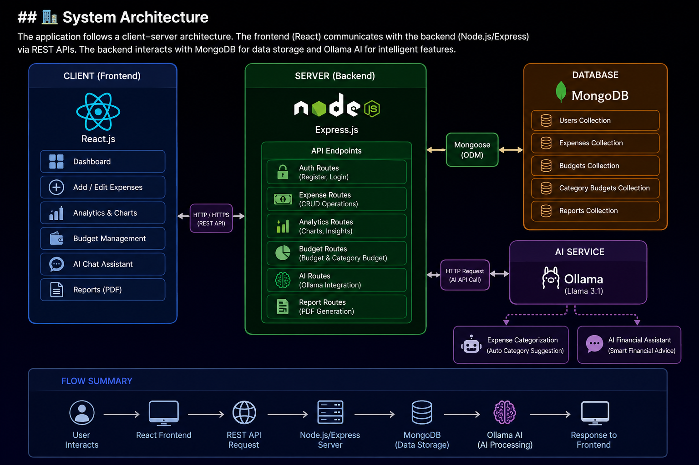

# 💰 Expense Tracker AI

A full-stack AI-powered expense management application.

## 🚀 Features

- User authentication (JWT)
- Add / update / delete expenses
- Monthly expense analytics
- Category-wise spending charts
- Budget management
- Category budget limits
- Monthly spending comparison
- Financial health score
- AI expense categorization
- AI financial assistant using Ollama
- Search and filter expenses
- PDF expense reports

## 🛠 Tech Stack

### Frontend

- React.js
- Tailwind CSS
- Recharts
- Axios

### Backend

- Node.js
- Express.js
- MongoDB
- Mongoose
- JWT Authentication

### AI

- Ollama
- Llama 3.1

## 🏗️ Design & Implementation

### 📌 System Architecture

The application follows a full-stack client-server architecture.

            React Frontend
                  |
                  |
               Axios API
                  |
                  |
          Node.js + Express
                  |
    -----------------------------
    |                           |

MongoDB Ollama AI

---

## 🔄 Application Flow

1. User registers/logs in
2. JWT token is generated
3. Frontend stores token
4. User performs actions:
   - Add expense
   - Update expense
   - Delete expense
   - View analytics

5. Backend:
   - Validates JWT
   - Processes request
   - Reads/writes MongoDB

6. AI Features:
   - Expense description sent to Ollama
   - AI suggests category
   - Financial assistant provides advice

---

## 🧩 Module Design

### Authentication Module

Responsible for:

- User registration
- Login
- JWT authentication
- Protected routes

Flow:
User
|
v
Login API
|
v
Validate credentials
|
v
Generate JWT
|
v
Access protected resource

---

### Expense Management Module

Handles:

- Creating expenses
- Editing expenses
- Deleting expenses
- Searching/filtering

Database:
Expense

{
userId,
amount,
category,
description,
date
}

---

### Analytics Module

Calculates:

- Monthly spending
- Category spending
- Average expense
- Transaction count

Flow:
MongoDB
|
v
Expense Aggregation
|
v
Analytics API
|
v
Charts (Recharts)

---

### Budget Module

Provides:

- Overall budget
- Category budgets
- Budget usage percentage
- Warning alerts

Example:
Food Budget

Limit: ₹3000

Spent: ₹2500

Usage: 83%

---

### AI Module

Uses Ollama local LLM.

Flow:
expense Description->backend ai controller->ollama api->category suggestion

---

## 🗂️ Folder Structure

expense-tracker

├── frontend
│ ├── src
│ │ ├── components
│ │ ├── pages
│ │ └── api
│
├── backend
│ ├── controllers
│ ├── models
│ ├── routes
│ ├── middleware
│ └── server.js

---

## 🔒 Security Implementation

- JWT based authentication
- Protected API routes
- Password hashing
- User-specific expense access
- Environment variables

---

## ⚡ Performance Considerations

- API based architecture
- Component reuse in React
- Efficient MongoDB queries
- Lazy loading ready structure

